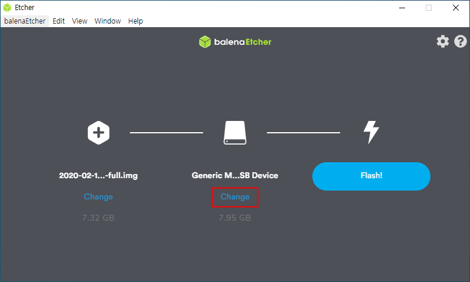
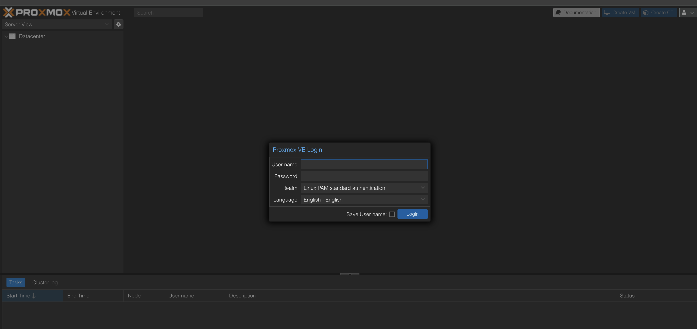
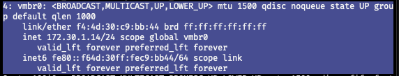

# 홈서버 구축기 - 1

## 목적

이전부터 막연하게 홈서버를 만들고 싶다는 생각을 이전부터 가진 적이 있었으나, 비용이랑 학습곡선 때문에 시도를 하지 못했었습니다.

그러나, 요즘 공부를 하면서 여러 실습들을 해볼 샌드박스도 필요했고 사이드 프로젝트로 돌아가는 서버들에 내는 비용이 아까워지기 시작해서 홈서버를 만들게 되었습니다.

가장 먼저 서버의 목적에 따라 구축하는 방식이 달라지기에, 목적부터 정해야했습니다.

- 학습한 내용을 실습하고 테스트할 수 있는 샌드박스 환경
- 사이드 프로젝트를 배포하고 운영하기 위한 서버 인프라

이 목적을 기준으로 하드웨어 스펙과 구축 방식을 결정했습니다.

## 하드웨어

### 고민점

홈서버를 만들겠다고 마음먹으면, 가장 먼저 부딪히는 고민은 하드웨어 선택입니다.

크게 아래 세 가지 선택지가 있습니다.
- SBC(Single Board Computer): 라즈베리파이, 오드로이드 등
- 미니 PC: 인텔 NUC, 맥 미니, 각종 브랜드 미니 PC
- 구형 컴퓨터: 안 쓰던 데스크탑, 노트북, 자작 서버

각각 장단점이 명확하기 때문에, 내가 원하는 목적에 어떤 하드웨어가 가장 잘 맞는지 기준을 정해서 선택할 필요가 있었습니다.

고려한 기준은 아래와 같습니다.

1. 성능

    실습을 위해서 가상화, 컨테이너, 여러 서비스들을 동시에 돌리는게 필요했고,
이를 위해선 어느정도 성능이 받쳐줘야 했습니다.

2. 전력 소모와 소음

    서버는 24시간 돌아가는 경우가 많아서, 전기요금과 소음도 중요한 요소였습니다.
전력 효율과 팬 소음을 최소화할 수 있다면 좋지만, 우선순위가 그리 높지는 않았습니다.

3. 확장성

    스토리지 추가, 메모리 업그레이드 같은 하드웨어 확장성이 얼마나 유연한지도 고민했습니다.
향후 서비스가 늘어나거나 데이터를 많이 저장하게 될 경우를 대비했습니다.

4. 호환성

    많은 서버 소프트웨어들이 x86 기반으로 동작하기에, 되도록이면 x86기반의 cpu 환경이었으면 했습니다.
    
5. 비용

    가장 현실적인 기준. 
클라우드 서버 운영 비용을 줄이려고 홈서버를 만드는 것 또한 목적이고, 아직은 학생이기에 하드웨어 비용도 최소화하고 싶었습니다.

결론적으론 오래된 컴퓨터 부품을 사서 조립하는 방향으로 잡았습니다.

소음과 전기가 걱정이긴 했지만 너무 심한 경우 wol로 조정할 수도 있기도 하고,   컴퓨터 하드웨어를 한 번도 만져본적이 없어서 하드웨어도 만져보며 트러블 슈팅을 통해 경험을 쌓아보고 싶었습니다.

구체적으로 하드웨어 스펙을 맞출 땐 이 [포럼 글](https://svrforum.com/hardware/573786
)을 참고하면서 설계했습니다.

일단 현재는 g5420 + ram 8gb + hdd 1TB 정도의 서버를 구축했는데, 총 10만원 가량 들었습니다. 
추후 필요하면 계속 확장하려고 합니다.

### 트러블 슈팅

- 구형 보드의 경우 초기 BIOS 설정에서 기본 출력이 VGA나 DVI로만 지정되어 있는 경우가 있다. 이때 HDMI 출력은 비활성화되어 화면이 나오지 않을 수 있습니다.
    - 이 경우 VGA 포트로 모니터를 연결한 후 BIOS에 진입하여 'Primary Display' 항목을 HDMI로 변경하면 해결
- 파워 서플라이는 과전류나 쇼트가 감지되면 보호 회로가 작동하여 자동으로 전원을 차단한다.   
핀을 잘못 꽂아 쇼트가 발생한 경우, 보호 회로가 활성화되어 보드가 더 이상 동작하지 않을 수 있다.  
    - 이럴 땐 모든 전원 케이블과 배터리를 분리하고 5~10분 정도 기다리면 보드에 남아 있는 잔류 전류가 방전되어 초기화된다. 이후 다시 연결하면 정상적으로 동작

## OS

하드웨어 구성을 마치고 나면, 이제는 서버에 어떤 OS를 올릴지 결정해야 합니다.
여러 가지 선택지 중에서 Proxmox를 선택했고, 이를 설치해서 운영하고 있습니다.

### 왜?

처음에는 Ubuntu Server에 Docker를 설치해서 간단하게 서비스들을 띄워볼까? 생각했었습니다.
실제로 예전에 홈서버를 만들려고 시도했을 때도 이 방법을 사용했었죠.

하지만 이번에는 단순히 컨테이너 몇 개를 띄워서 서비스를 운영하는 걸 넘어서,
여러 VM을 띄워서 각각 통신시키고,
조금 더 로우 레벨에서 시스템과 네트워크를 실습해보고 싶었습니다.
특히, 분산 데이터베이스 환경을 직접 구성하고 테스트해볼 필요가 있었기 때문에
일반적인 서버 OS보다는 가상화에 최적화된 하이퍼바이저가 필요했습니다.

그 중에서 가장 괜찮아 보였던 게 바로 Proxmox였고,
그래서 이번 홈서버는 Proxmox를 기반으로 구축하게 되었습니다.

### 설치

1. BelenatEtcher를 통한 부팅 디스크 만들기
    - 가장 먼저 proxmox iso 파일로 usb를 굽고 이를 통해 서버에 설치해야 합니다.
    - 과거에는 [블로그](https://coding-groot.tistory.com/151) 를 보고 부팅 디스크를 만들었으나 이는 굉장히 번거로웠습니다.
    - 다행히 맥/윈도우 환경에서 부팅 디스크를 쉽게 만들 수 있는 도구가 있습니다.
    - belenaEtcher라고 하며 아래 같이 아주 간단하게 부팅 디스크를 만들 수 있습니다.

2. proxmox 설치
    - proxmox를 설치하는 것은 gui로 잘 제공되어있고, 이에 대한 과정은 인터넷에 잘 나와있어서 잘 따라하면 됩니다.
    - 하지만, 이 때 주의해야할 것이 있는데 proxmox는 설치과정 중에 네트워크에 대한 정보를 입력하는 부분이 있습니다.
    - proxmox는 이 떄 연결된 네트워크 기준으로 네트워크 정보가 입력이 됩니다.
    - proxmox는 고정 ip 방식이기 때문에 설정한 ip가 영구적으로 저장됩니다.
    - 이 말인 즉, 설치한 환경과 서버를 구동시킬 환경이 다르면, ip 정보가 맞지 않아 네트워크 통신이 안 됩니다.
    - 물론 나중에 직접 접속해서 수정할 순 있긴 하지만, 귀찮기 때문에 설치할 때 꼭 서버를 구동시킬 곳에서 유선으로 연결 후 설치하도록 합시다.

확인
- proxmox가 설치가 되면 재부팅 후 IP주소와 포트번호가 쉘에 나옵니다.
- 동일 네트워크 내에 속한 pc로 접속하여 웹 콘솔을 확인해봅시다.
- 아래처럼 나오면 성공 

### 네트워크 모드

Proxmox에서 여러 VM을 운영하기 위해서는 네트워크 모드를 적절히 구성하는 것이 중요하다.  
대표적인 네트워크 모드로는 Bridge 모드, NAT 모드, 그리고 Host-only 모드가 있으며, 각 방식은 목적과 네트워크 환경에 따라 다르게 선택될 수 있다.

1. Bridge 모드

2. NAT 모드
3. Host-Only 모드

## 원격 접속